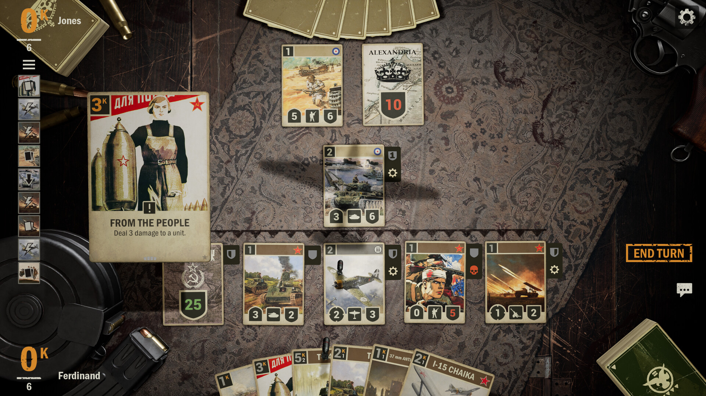

# Kardx

A digital collectible card game built with Unity that simulates the physical card game mechanics of [Kards](https://kards.com/), a popular World-War II-style strategy card game. It is a turn-based game where players deploy units to the battlefield, use abilities, and attack opponents to win.

## Overview

Kardx is a turn-based card game where players deploy units to the battlefield, use abilities, and attack opponents to win. The game features:

- A data-driven card system
- Ability-based gameplay mechanics
- Battlefield positioning strategy
- Hand and resource management

## Design Documents

For developers who want to understand the project better:

- [Architecture](./Docs/Arch.md) - Overview and design principles of the game's architecture
- [Data System Design](./Docs/Data.md) - Data structures, demonstrates how to make model-view-controller (MVC) game design
- [Ability System Design](./Docs/Ability.md) - How card abilities work, demonstrates how to make data-driven system design

## Getting Started

### Prerequisites

- Unity 6 (v6000.0.41f1) - [Download from Unity Hub](https://unity.com/download)
- Basic understanding of C# language and Unity concepts

### Required Unity Packages

Install these packages to work with the project:

1. **Windsurf Integration**
   - Install from Git URL: `https://github.com/Asuta/com.unity.ide.windsurf.git`
   - Windsurf offers better performance than Cursor IDE

1. **DOTween**
 	 - This is a Unity package for animation, required in this project.

1. **Unity Extension**
   - It is strongly recommended to install the Unity extension for VSCode in Windsurf. Since it did not release as open-vsx, you should look for this extension (and also C# and C# DevKit) in VSCode (version later than 1.96) and download it as vsx file and then manually install in Windsurf.

1. **NewtonSoft JSON**
   - Add from Package Manager: `com.unity.nuget.newtonsoft-json`
   - Used for JSON serialization/deserialization

C# code is formatted with the C# extension installed with Unity extension. It's recommended to enable Format On Save in the configuration.

## Project Structure

All code and assets are organized in the `Assets` folder:

### Code Organization

- **`Assets/Scripts/Core`** - Core game logic
  - Card, Player, Board, and Ability classes
  - **`/Acting`** - Ability system implementation (card effects and triggers)
  - **`/Planning`** - Strategy planning logic of opponent, for both AI and remote players
  - **`/AI`** - AI logic for the opponent (to be implemented)

- **`Assets/Scripts/UI`** - User interface components
  - **`/Components`** - connected to Unity UI elements
  - **`/Scenes`** - connected to Unity Scenes, the most important one is `MatchView`

### Asset Organization

- **`Assets/Sprites`** - Static game sprites
- **`Assets/Resources`** - Dynamically loaded art (card faces, etc.)
- **`Assets/StreamingAssets`** - JSON data files (CardTypes, AbilityTypes)

## Development Tips

- Read the design documents before making changes
- The game uses a data-driven approach - many game elements are defined in JSON
- Check the `CardLoader.cs` and `AbilityType.cs` files to understand how data is loaded
- Use the Unity Console to debug issues during gameplay

## License

This project is licensed under the [MIT](./LICENSE) license.
