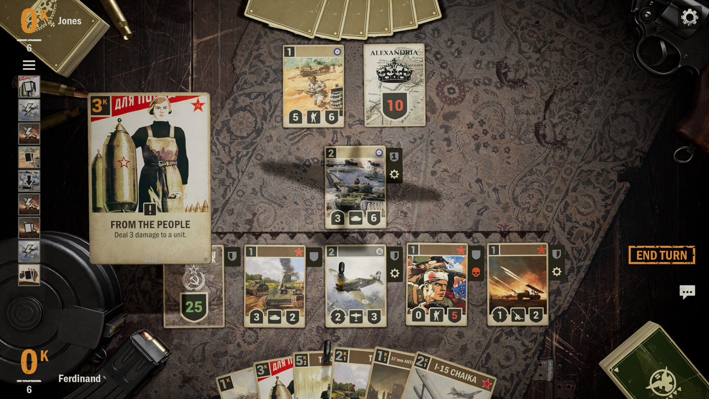

# Kardx

A digital collectible card game built with Unity that simulates the physical card game mechanics of [Kards](https://kards.com/), a popular World-War II-style strategy card game. It is a turn-based game where players deploy units to the battlefield, use abilities, and attack opponents to win.

## Overview

Kardx is a turn-based card game where players deploy units to the battlefield, use abilities, and attack opponents to win. The game features:

- A data-driven card system
- Ability-based gameplay mechanics
- Battlefield positioning strategy
- Hand and resource management
- Unified card drag-and-drop for deploy, attack, move, and order play

## Design Documents

For developers who want to understand the project better:

- [Architecture](./Docs/Arch.md) - Overview and design principles of the game's architecture
- [Data System Design](./Docs/Data.md) - Data structures and the model-view-controller (MVC) layout
- [Ability System Design](./Docs/Ability.md) - How card abilities work in the data-driven system

## Getting Started

### Prerequisites

- Unity 6 (v6000.0.41f1) - [Download from Unity Hub](https://unity.com/download)
- Basic understanding of C# language and Unity concepts

### Required Unity Packages

Install these packages to work with the project:

1. **Windsurf Integration**
   - Install from Git URL: `https://github.com/Asuta/com.unity.ide.windsurf.git`
   - Windsurf offers better performance than Cursor IDE

1. **DOTween**
   - This is a Unity package for animation, required in this project.

1. **Unity Extension**
   - It is strongly recommended to install the Unity extension for VSCode in Windsurf. Since it did not release as open-vsx, you should look for this extension (and also C# and C# DevKit) in VSCode (version later than 1.96) and download it as vsx file and then manually install in Windsurf.

1. **NewtonSoft JSON**
   - Add from Package Manager: `com.unity.nuget.newtonsoft-json`
   - Used for JSON serialization/deserialization

C# code is formatted with the C# extension installed with Unity extension. It's recommended to enable Format On Save in the configuration.

## Project Structure

All code and assets are organized in the `Assets` folder:

### Code Organization

The codebase follows an MVC layout under `Assets/Scripts/`:

- **`Models/`** - Game state and rules
  - **`Cards/`** - `Card`, `CardType`, `CardCollection`, `Hand`, `Deck`, `Battlefield`, `DiscardPile`
  - **`Match/`** - `Board`, `Player`, `MatchManager`
  - **`Abilities/`** - Ability type definitions
- **`Views/`** - UI components that reflect model state
  - **`Cards/`** - `CardView`, `CardDetailView`
  - **`Hand/`** - `PlayerHandView`, `OpponentHandView`
  - **`Match/`** - `MatchView`, battlefield views, card slots, attack arrow
  - **`Home/`** - Home screen
- **`Controllers/`** - Input handling
  - **`DragHandlers/`** - Unified drag workflow (`CardDragController`, `CardDragCapability`, `CardDropResolver`)
- **`Managers/`** - Cross-cutting services (`ViewManager`, `ViewRegistry`, `TabManager`)
- **`Acting/`** - Ability system runtime (`AbilitySystem`, effect handlers)
- **`Planning/`** - AI and strategy planning (`StrategyPlanner`, `DummyStrategyProvider`)
- **`Utils/`** - Shared utilities (`CombatRules`, `CardLoader`, `GameStateValidator`)

### Asset Organization

- **`Assets/Sprites`** - Static game sprites
- **`Assets/Resources`** - Dynamically loaded art (card faces, etc.)
- **`Assets/StreamingAssets`** - JSON data files (CardTypes, AbilityTypes)
- **`Assets/Scenes`** - `StartingScene`, `HomeScene`, `BattleScene`, `CardScene`

### Development Tools

#### FindMissingScripts

A utility editor tool to help locate GameObjects with missing script references in your scene.

**Usage:**
1. Go to the Unity menu and select `Tools > Find Missing Scripts`
2. In the window that appears, you can:
   - Click "Find Missing Scripts in Scene" to scan the entire scene
   - Click "Find Missing Scripts in Selected GameObjects" to scan only selected objects
3. Results will be logged to the Unity Console, showing which GameObjects have missing script references

This tool is particularly helpful when you encounter the "The referenced script (Unknown) on this Behaviour is missing!" error, which doesn't provide location information.

## Web Build and Deployment

The project includes a GitHub Actions workflow (`.github/workflows/webgl-pages.yml`) that builds a WebGL player and deploys it to GitHub Pages on pushes to `main`.

Required repository secrets for CI builds:

- `UNITY_LICENSE`
- `UNITY_EMAIL`
- `UNITY_PASSWORD`

See [game.ci activation docs](https://game.ci/docs/github/activation) for setup.

## Development Tips

- Read the design documents before making changes
- The game uses a data-driven approach - many game elements are defined in JSON
- Check `CardLoader.cs`, `DeckBuilder.cs`, and `AbilityType.cs` to understand how data is loaded
- Zone changes (`Hand`, `Battlefield`, etc.) must go through `CardCollection` APIs so ownership, zone state, and events stay consistent
- Combat targeting rules live in `CombatRules.cs`; `MatchManager.CanAttack` adds credit checks on top
- Use the Unity Console to debug issues during gameplay

## License

This project is licensed under the [MIT](./LICENSE) license.
